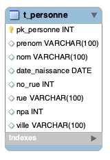

# Démonstration transactions et verrouillage

## Schéma de la BD - Personnes



## Procédure de démonstration

1) Ouvrir un nouveau terminal distinct dans VSC (menu "Terminal")
2) Ouvrir un 2ème terminal distinct dans VSC en le mettant à côté du précedent afin de bien voir leur contenu simultanément (pour cela cliquer sur l'icône fenêtre sur la ligne du 1er nouveau bash qui s'est ouvert)
3) Dans chacun de ces terminaux, exécuter la commande suivante afin de se connecter à un shell MySQL et pouvoir ensuite exécuter des requêtes SQL (le mot de passe est `example_password`)  

   ```bash
   docker compose exec db mysql -u example_user -p
   ```

4) Dans ces 2 terminaux, saisir ensuite les commandes ci-dessous en fonction de la démo souhaitée

## Scénario 1

**BUT :** Verrouiller 1 enregistrement (une personne spécifique) et montrer qu'un autre usager sera mis en attente.

**Console N°1**

```sql
USE example_db;
set autocommit=0;
START TRANSACTION;
SELECT * FROM t_personne WHERE pk_personne = 1 FOR UPDATE;
-- ATTENDRE ICI AVANT DE SAISIR LA SUITE
-- PASSER A LA CONSOLE N°2 QUI SE BLOQUERA SUR LE MÊME FOR-UPDATE !
UPDATE t_personne SET nom = 'XXXX' WHERE pk_personne = 1;
-- CONSTATER DANS PHPMYADMIN QUE LE NOM N'A AS ENCORE CHANGÉ, IL N'EST PAS ENCORE VISIBLE !!
commit;
set autocommit=1;
```

**Console N°2**

```sql
USE example_db;
set autocommit=0;
START TRANSACTION;
-- IL VA SE BLOQUER CAR C'EST LE MÊME FOR-UPDATE !!!
-- IL SERA LIBERE LORS DU COMMIT OU ROLLBACK AYANT REALISE CE FOR-UPDATE...
-- BON, SI ON ATTEND TROP LONGTEMPS IL Y AURA UN TIME-OUT
SELECT * FROM t_personne WHERE pk_personne = 1 FOR UPDATE;
UPDATE t_personne SET nom = 'YYYY' WHERE pk_personne = 1;
commit;
set autocommit=1;
```

## Scénario 2

**BUT :** Verrouiller 2 enregistrements (par exemple source et destination IBAN) et montrer qu'un autre usager sera mis en attente (de l'un et/ou de l'autre).

> [!IMPORTANT]
> Veuillez observer que **la pk_personne N°2** est présente dans chacune des deux requêtes **`FOR UPDATE`** ci-dessous :-)

**Console N°1**

```sql
USE example_db;
SET autocommit=0;
START TRANSACTION;
SELECT * FROM t_personne WHERE pk_personne IN (1,2) FOR UPDATE;
SELECT * FROM t_personne WHERE pk_personne = 1;
UPDATE t_personne SET nom = '111' WHERE pk_personne = 1;
SELECT * FROM t_personne WHERE pk_personne = 1;
SELECT SLEEP(10);
COMMIT;
SET autocommit=1;
SELECT SLEEP(5);
SELECT * FROM t_personne WHERE pk_personne = 1;
```

**Console N°2**

```sql
USE example_db;
SET autocommit=0;
START TRANSACTION;
SELECT * FROM t_personne WHERE pk_personne IN (2,3) FOR UPDATE;
UPDATE t_personne SET nom = '222' WHERE pk_personne = 1;
COMMIT;
SET autocommit=1;
SELECT * FROM t_personne WHERE pk_personne = 1;
```

### Que montre ce scénario ?

Ce scénario va montrer :

- la transaction N°2 mise en attente que la N°1 se termine
- la transaction N°1 afficher le nom de la personne :
  - avant sa modification
  - après sa modification
  - puis le nom de la personne après sa modification par la transaction N°2

Cela prouve que :

- la transaction N°2 était bien mise en attente que la N°1 se termine, et qu'aussitôt le verrou relâché elle a pu procéder à la modification souhaitée.  
- que l'on peut se coordonner sur une ressource (ici la pk N°2) et mettre à jour tout à fait autre-chose.

---


