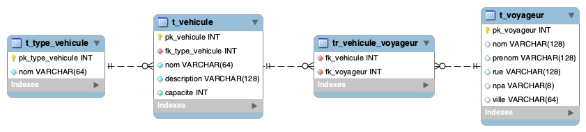

# Démonstration transactions et verrouillage

## Schéma de la BD - Bus company



## Explication de la démonstration

On va créer une méthode (procédure stockée MySQL) nommée `AjouterVoyageurs()` qui prend un **id_vehicule** + **une liste de id_voyageurs**.

Cette méthode commence par verrouiller le véhicule concerné.
Ensuite, pour simuler plus facilement la situation, elle dort 5 secondes.

La méthode affiche tout ce qu'elle fait au fur et à mesure, ce qui permet de bien voir qu'un éventuel 2ème appel sur le même véhicule sera mis en attente que le 1er finisse (relâche le verrou).

> [!IMPORTANT]
> C'est ainsi qu'on peut correctement gérer la capacité d'un véhicule, et ce **peu importe le nombre d'utilisateurs simultanés intéragissant avec la base de données et en particulier ce véhicule**.  
>
> Cette façon de faire **permet de détecter d'éventuels dépassements de capacité et de les traiter correctement**.  
> **La base de données est toujours laissée dans un état cohérent et respectueux de ces limites**.

## Procédure de démonstration

1) Ouvrir un nouveau terminal distinct dans VSC (menu "Terminal")
2) Ouvrir un 2ème terminal distinct dans VSC en le mettant à côté du précedent afin de bien voir leur contenu simultanément (pour cela cliquer sur l'icône fenêtre sur la ligne du 1er nouveau bash qui s'est ouvert)
3) Dans chacun de ces terminaux, exécuter la commande suivante afin de se connecter à un shell MySQL et pouvoir ensuite exécuter des requêtes SQL (le mot de passe est `example_password`)  

   ```bash
   docker compose exec db mysql -u example_user -p
   ```

4) Créez la procédure stockée suivante dans l'un des terminaux (elle sera utilisable ensuite depuis n'importe où):

    ```sql
    DROP PROCEDURE IF EXISTS AjouterVoyageurs;

    DELIMITER $$

    CREATE PROCEDURE AjouterVoyageurs(
       -- id du véhicule dans lequel les voyageurs doivent être ajoutés
        IN id_vehicule INT,
       -- Liste des pk des voyageurs sous la forme "pk1,pk2,pk3"
        IN liste_voyageurs TEXT
    )
    BEGIN
        DECLARE capacite_totale INT;
        DECLARE nb_voyageurs_actuels INT;
        DECLARE nb_voyageurs_a_ajouter INT;
        DECLARE nb_voyageurs_en_trop INT;
        DECLARE msg_erreur VARCHAR(255);

        SET autocommit=0;
        START TRANSACTION;

        -- Verrouillage du vehicule concerné
        SELECT 'Tentative de verrouillage du vehicule en cours...' AS Message;
        SELECT pk_vehicule FROM t_vehicule WHERE pk_vehicule = id_vehicule FOR UPDATE;
        SELECT 'Le vehicule est maintenant verrouille !' AS Message;

        -- On va perdre du temps pour simuler que la BD peut être sur les gencives
        -- et laisser le temps de lancer l'autre appel
        SELECT 'Le dodo commence...' AS Message;
        SELECT SLEEP(5);
        SELECT 'Le dodo est fini !' AS Message;

        -- Récupérer la capacité totale du véhicule
        SELECT capacite INTO capacite_totale FROM t_vehicule WHERE pk_vehicule = id_vehicule;

        -- Récupérer le nombre actuel de voyageurs dans le véhicule
        SELECT COUNT(*) INTO nb_voyageurs_actuels FROM tr_vehicule_voyageur WHERE fk_vehicule = id_vehicule;

        -- Compter combien de voyageurs sont à ajouter
        SET nb_voyageurs_a_ajouter = (LENGTH(liste_voyageurs) - LENGTH(REPLACE(liste_voyageurs, ',', '')) + 1);

        -- Vérification de la capacité
        IF (nb_voyageurs_actuels + nb_voyageurs_a_ajouter) <= capacite_totale THEN

            -- D'autres tests seraient encore nécessaire (vous voyez lesquels ?)
            -- mais on va faire simple pour le moment, c'est qu'une démo.

            -- Insertion depuis la liste des voyageurs
            INSERT INTO tr_vehicule_voyageur (fk_vehicule, fk_voyageur)
            SELECT id_vehicule, pk_voyageur
            FROM t_voyageur
            WHERE FIND_IN_SET(pk_voyageur, liste_voyageurs) > 0;

            SELECT 'Ajout des voyageurs reussi !' AS Message;

            COMMIT;
        ELSE
            -- Annulation car la capacité est dépassée
            ROLLBACK;
            SET nb_voyageurs_en_trop = nb_voyageurs_a_ajouter + nb_voyageurs_actuels - capacite_totale;
            SET msg_erreur =  CONCAT('Capacite insuffisante : il manque ', nb_voyageurs_en_trop, ' places');
            SIGNAL SQLSTATE '45000' SET MESSAGE_TEXT = msg_erreur;
        END IF;
        SET autocommit=1;    
    END$$

    DELIMITER ;
    ```

> [!NOTE]
> **Cette procédure stockée n'est de loin pas un exemple a suivre**. Elle n'est qu'un exemple pour montrer et expliquer le concept (d'avoir toute la logique métier rassemblée à un endroit, loin du client qui ne doit pas être "fat").
>
> Une version plus aboutie de cette procédure stockée, bien plus "propre", sera réalisée dans un l'exercice suivant ;-)

### Console pour simuler l'opérateur voyagiste N°1

```sql
-- -----------------------------------------------------------------------
-- On veut placer les 2 passagers pk_yoyageur N°10 et 11 (FRANZEN et GODEL)
-- dans la voiture "V1" (pk=6)
-- 
-- Appel de la procédure
-- -----------------------------------------------------------------------
CALL AjouterVoyageurs(6, "10,11");
```

### Console pour simuler l'opérateur voyagiste N°2

```sql
-- -----------------------------------------------------------------------
-- On veut placer les 2 passagers pk_yoyageur N°1 et 2 (VAUTHEY et GOLAY)
-- dans la voiture "V1" (pk=6)
-- 
-- Appel de la procédure
-- -----------------------------------------------------------------------
CALL AjouterVoyageurs(6, "1,2");
```

---


